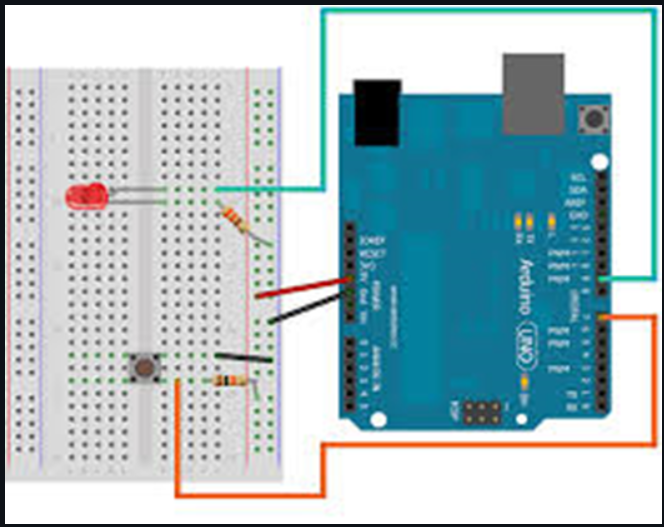
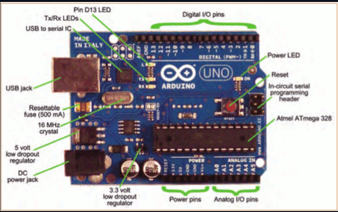
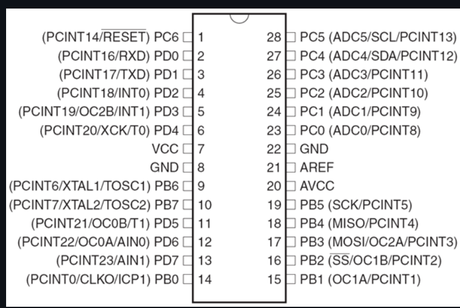
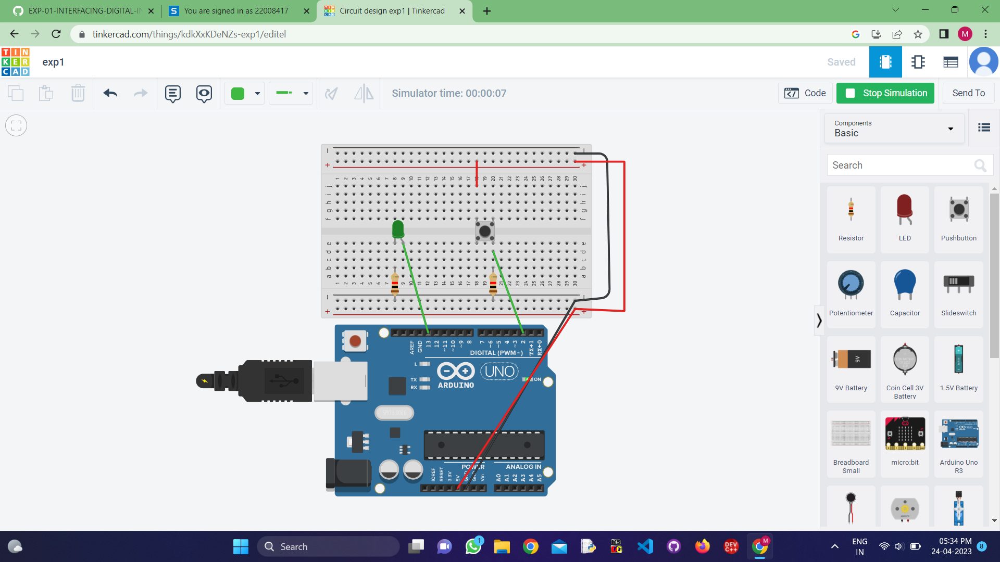

#  EXP-01-INTERFACING-DIGITAL-INPUT-SENSOR-WITH-ARDUINO-PUSH-BUTTON

## AIM:  To interface a digital input (push button) and blink and LED upon activation.
COMPONENTS REQUIRED:
1.	1 KΩ Resistor 
2.	Arduino Uno 
3.	Bread board 
4.	USB Interfacing cable 
5.	Jumper wires 
6.	LED of choice 
## THEORY :
Arduino UNO
 	  The Uno is a microcontroller board based on the ATmega328P. It has 14 digital input/output pins (of which 6 can be used as PWM outputs), 6 analog inputs, a 16 MHz quartz crystal, a USB connection, a power jack, an ICSP header and a reset button. It contains everything needed to support the microcontroller; simply connect it to a computer with a USB cable or power it with a AC-to-DC adapter or battery to get started.
	Technical specifications of Arduino UNO :
Microcontroller	ATmega168/328
Microcontroller	ATmega168/328
Operating Voltage	5V
Input Voltage (recommended)	7-12V
Input Voltage (limits)	6-20V
Digital I/O Pins	14 (of which 6 provide PWM output)
Analog Input Pins	6
DC Current per I/O Pin	40 mA
DC Current for 3.3V Pin	50 mA
Flash Memory	16 KB (ATmega168) or 32 KB (ATmega328) of which 2 KB used by boot loader
SRAM	1 KB (ATmega168) or 2 KB (ATmega328)
EEPROM	512 bytes (ATmega168) or 1 KB (ATmega328)
Clock Speed	16 MHz
PIN DIAGRAM FOR ATMEGA 328

## FIGURE 1

## FIGURE 2


## PROCEDURE 
 Open tinker cad account 
1.	Select Arduino uno , bread board , digital input and digital output 
2.	Connect the circuit as given in the figure 
3.	Develop the program and compile it for any errors 
4.	 .Execute the program 
5.	Check the simulation 


## CIRCUIT DIAGRAM 





## PROGRAM 
 ```
 //C++ code
int buttonstate = 0;

void setup()
{
  pinMode(2,INPUT);
  pinMode(13, OUTPUT);
}

void loop()
{
  buttonstate = digitalRead(2); 
  if(buttonstate == HIGH)
  {
    digitalWrite(13,HIGH);
  }
  else
  {
    digitalWrite(13,LOW);
  }
  delay(10); 
}
```
## OUTPUT
 
Before simulation



After simulation


 
 
 
## RESULT
Interface a digital input (push button) and blink and LED upon activation is sucessfully excicuted.


